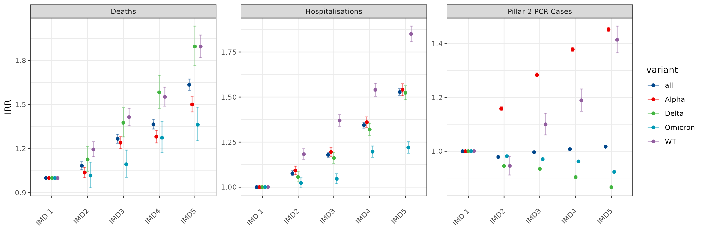
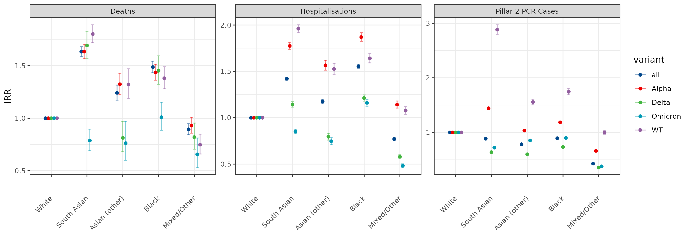
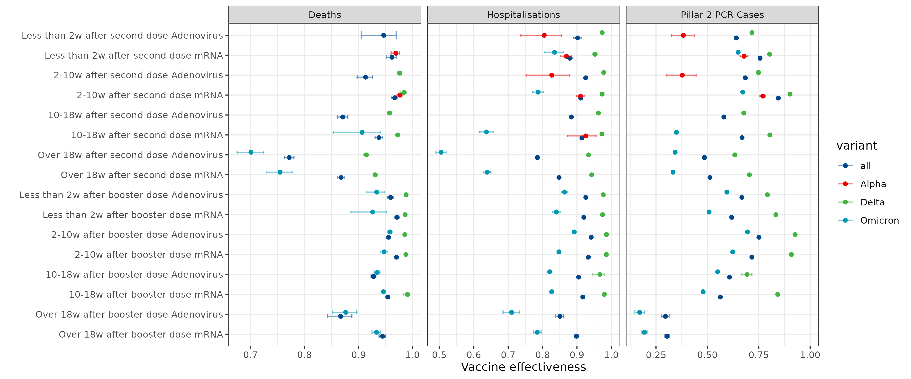
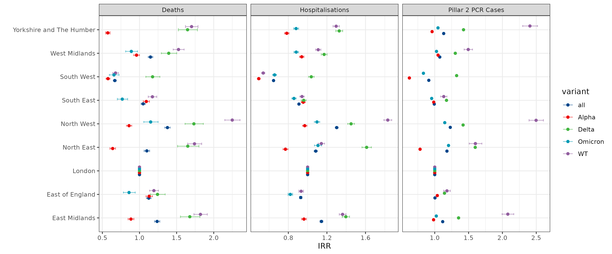

Results summary for *Socioeconomic and temporal heterogeneity in
SARS-CoV-2 exposure and disease in England from May 2020 to February
2023*
================

By December 2023, the COVID-19 pandemic had resulted in over 20.5
million confirmed cases and 175,000 deaths in England. The pandemic’s
impact varied significantly across different population groups,
influenced by deprivation, ethnicity, and policy measures. We analysed
individual-level data on SARS-CoV-2 testing, hospitalisations, deaths,
and vaccination records in England from May 2020 to February 2022. We
used Poisson regression models to estimate incidence rate ratios (IRRs)
for first pillar 2 PCR positive cases, associated hospitalisations, and
deaths, adjusting for sex, ethnicity, deprivation, geographic region,
age, and epidemiological week.

### Socioeconomic heterogeneity measured by the *Index of Multiple Deprivation*

``` r
main_model_fit <- readRDS('data/main_model_fits.RDS')

plot_IRR_results(main_model_fit,include = c('death','hosp','pillar2pcr'),filter_by='IMD') 
```

<!-- -->

### Ethnicity

``` r
plot_IRR_results(main_model_fit,include = c('death','hosp','pillar2pcr'),filter_by='ethnicity') 
```

<!-- -->

### Vaccination status

``` r
plot_IRR_results(main_model_fit,include = c('death','hosp','pillar2pcr'),filter_by='vacc_status', min_p_value = 0.05,restrict_vacc_plot = TRUE,plot_VE = TRUE) #+ theme(legend.position = 'bottom')
```

<!-- -->

### Region

``` r
plot_IRR_results(main_model_fit,include = c('death','hosp','pillar2pcr'),filter_by='RGN21NM') 
```

<!-- -->

### Age

``` r
plot_IRR_results(main_model_fit,include = c('death','hosp','pillar2pcr'),filter_by='age_v2') 
```

<!-- -->

### Sex

``` r
plot_IRR_results(main_model_fit,include = c('death','hosp','pillar2pcr'),filter_by='sex') 
```

<!-- -->

### Restrictions

``` r
plot_IRR_results(main_model_fit,include = c('death','hosp','pillar2pcr'),filter_by='restriction') 
```

<!-- -->
